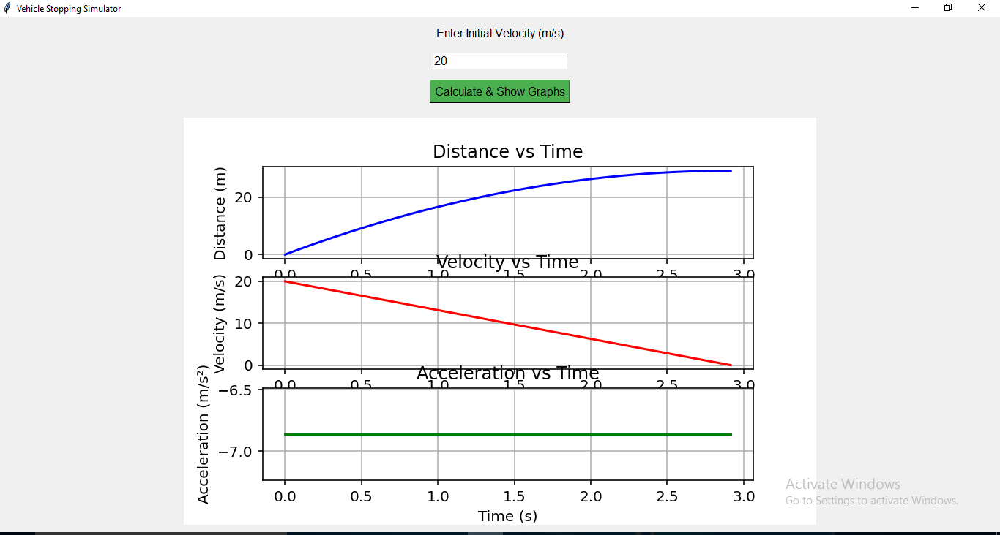

# 🚗 Vehicle Simulator

A physics-based vehicle simulator built using Python that models the motion of a vehicle using fundamental concepts of kinematics.

---

## 📌 About the Project

This project was developed to combine **Physics and Programming** by simulating how a vehicle moves under different conditions such as acceleration and speed.

It demonstrates how real-world motion principles can be translated into code.

> Built independently as part of the **CML (Computational Mechanics Lab)** initiative.

---

## ⚙️ Features

- Simulates vehicle motion
- Calculates speed using acceleration
- User input-based interaction
- Simple and clean logic for understanding physics concepts

---

## 🧠 Physics Concepts Used

- Equations of Motion (v = u + at)
- Speed, Velocity, and Acceleration
- Basic kinematics

---

## 💻 Technologies Used

- Python
- Developed using Spyder IDE

---

## ▶️ How to Run

1. Download or clone this repository
2. Open the file in any Python IDE (Spyder, etc.)
3. Run the program
4. Enter required inputs when prompted

---

## 📸 Output

---

## 🔍 Observations

- Speed increases with acceleration over time
- Motion follows basic kinematic equations
- User inputs directly affect simulation results

---

## 🚀 Future Improvements

- Add graphical interface using Pygame
- Introduce multiple vehicle types
- Add fuel consumption system
- Implement real-time simulation
- Include data visualization (graphs)

---

## 🙋‍♀️ Author

**Tamanna Singh**  
Class 12| Aspiring Mechanical Engineer  
Interested in Physics, Coding, and Simulation Systems

---

## ⭐ Note

This is an initial version of the simulator. Future versions will aim to make the simulation more realistic and interactive.
